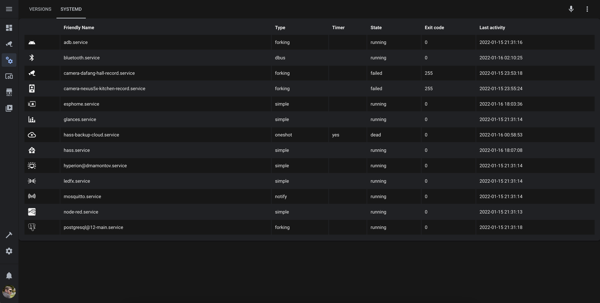

# Systemd Manager for Home Assistant
[](https://github.com/custom-components/hacs)
[](https://paypal.me/dslonyara)
[](https://www.tinkoff.ru/sl/3FteV5DtBOV)

The component allows you to manage systemd services via [D-Bus](https://www.freedesktop.org/wiki/Software/dbus/)

## Table of Contents
- [Prerequisites](#prerequisites)
- [Install](#install)
- [Config](#config)
- [Advanced config](#advanced-config)
- [Services](#services)
- [Performance table](#performance-table)

## Prerequisites
#### Ubuntu
1. This component uses `D-Bus` to control `systemd`. You need to have D-Bus itself and its python bindings in order to use this component:
```shell
sudo apt install dbus libdbus-glib-1-dev libdbus-1-dev python-dbus
```

2. You also need to set up a `polkit` rule so that your user can control systemd via D-Bus. To do this, run the command and paste the content:
```shell
sudo nano /etc/polkit-1/localauthority/50-local.d/systemd-manager.pkla
```
```ini
[Allow user systemd-manager to execute systemctl commands]
Identity=unix-user:<your user from which hass is executed.>
Action=org.freedesktop.systemd1.manage-units
ResultAny=yes
```
#### Other
Not yet tested

## Install
Installed through the custom repository [HACS](https://hacs.xyz/) - `dmamontov/hass-systemd-manager`

Or by copying the `systemd_manager` folder from [the latest release](https://github.com/dmamontov/hass-systemd-manager/releases/latest) to the custom_components folder (create if necessary) of the configs directory.

## Config
#### Via GUI (Only)

`Settings` > `Integrations` > `Plus` > `Systemd Manager`

All you have to do is select the systemd services you want to manage.

#### Warnings
1. Only one configuration is allowed;
2. Do not select all services, this increases the load on the processor, especially D-Bus;

## Advanced config
To get the status of the services, the component requests the status of the services every 10 seconds. This value can be changed in the component's settings.

## Services
All services support only entity_id.

[Mode detail](https://www.freedesktop.org/wiki/Software/systemd/dbus/)

**start**
```yaml
service: systemd_manager.start
data:
  mode: REPLACE # One of REPLACE, FAIL, ISOLATE, IGNORE_DEPENDENCIES, IGNORE_REQUIREMENTS
target:
  entity_id: switch.systemd_...
```

**stop**
```yaml
service: systemd_manager.stop
data:
  mode: REPLACE # One of REPLACE, FAIL, IGNORE_DEPENDENCIES, IGNORE_REQUIREMENTS
target:
  entity_id: switch.systemd_...
```

**restart**
```yaml
service: systemd_manager.restart
data:
  mode: REPLACE # One of REPLACE, FAIL, IGNORE_DEPENDENCIES, IGNORE_REQUIREMENTS
target:
  entity_id: switch.systemd_...
```

**enable**
```yaml
service: systemd_manager.enable
target:
  entity_id: switch.systemd_...
```

**disable**
```yaml
service: systemd_manager.disable
target:
  entity_id: switch.systemd_...
```

## Performance table


1. Install [Flex Table](https://github.com/custom-cards/flex-table-card) from HACS
2. Add new Lovelace tab with **Panel Mode**
3. Add new Lovelace card:
   - [example](https://gist.github.com/dmamontov/e8c52c129fb19fca633d0d2d779676e3)